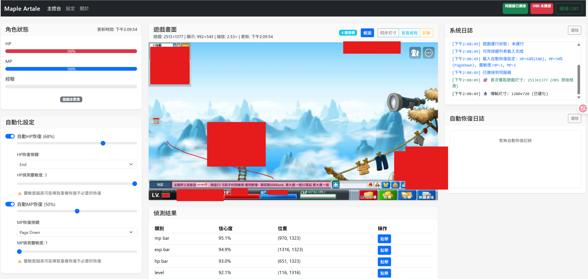

# Aron.MaplestoryArtale - 楓之谷 Artale 遊戲輔助系統

專為 MapleStory Artale 設計的遊戲輔助工具，透過 OBS 擷取遊戲畫面，利用 AI 影像辨識實現自動化功能。

**[🎥 觀看功能示範影片](https://youtu.be/YYn0WYdpDrA)**

---

## 📋 目錄

- [功能總覽](#-功能總覽)
- [已完成功能](#-已完成功能)
- [未來計畫](#-未來計畫)
- [使用說明](#-使用說明)
- [程式與 OBS 的關聯](#-程式與-obs-的關聯)
- [授權與使用條款](#-授權與使用條款)

---

## ⚡ 功能總覽

| 功能 | 狀態 | 說明 |
|------|------|------|
| 🔴 自動 HP 恢復 | ✅ 已完成 | 血量低於設定值自動喝水 |
| 🔵 自動 MP 恢復 | ✅ 已完成 | 魔力低於設定值自動補魔 |
| ⌨️ 自動按鍵 | ✅ 已完成 | 定時自動按下指定按鍵（支援 10 組） |
| 🔄 防卡鍵 | ✅ 已完成 | 累計按鍵後自動按方向鍵防止卡點 |
| 📊 練功統計 | ✅ 已完成 | 即時經驗值獲得效率統計 |
| 📈 角色狀態監控 | ✅ 已完成 | 即時顯示 HP/MP/EXP 百分比 |
| 🎮 遊戲畫面預覽 | ✅ 已完成 | AI 偵測標記即時顯示 |
| 🏪 自動跑自由 | 🚧 開發中 | 閒置時自動進出自由市場 |
| 🚕 計程車功能 | 📅 計畫中 | 自動移動到指定地圖 |
| 🤖 AI 自動打怪 | 📅 計畫中 | 偵測怪物位置自動攻擊 |

---

## ✨ 已完成功能

### 1. 自動 HP/MP 恢復
- **自訂觸發百分比**：可設定低於多少 % 時自動喝水
- **自訂按鍵**：可指定對應的鍵盤按鍵（如 End、PageDown）
- **靈敏度調整**：1-3 級靈敏度，避免畫面波動造成誤判
- **快速恢復**：比寵物更快的恢復速度，適合邊吃東西邊掛機

### 2. 自動按鍵（祈禱機/Buffer 專用）
- **10 組按鍵設定**：每組可獨立啟用/停用
- **隨機間隔**：可設定最小/最大間隔時間，模擬人工操作
- **按鍵名稱**：自訂名稱方便辨識（如「祈禱」「聖靈」）
- **防卡鍵功能**：累計一定次數後自動按方向鍵，防止角色卡點

### 3. 角色狀態監控
- **即時數值顯示**：HP、MP、EXP 百分比圖形化顯示
- **遊戲聚焦狀態**：顯示遊戲視窗是否在前景

### 4. 練功統計
- **經驗效率追蹤**：紀錄 1/5/10/30/60 分鐘內的經驗值獲得
- **消耗統計**：HP/MP 恢復次數統計
- **重置功能**：隨時可重新計算

### 5. 遊戲畫面預覽
- **即時畫面**：顯示 OBS 擷取的遊戲畫面
- **AI 偵測標記**：紅/藍/綠框標示血條、魔力條、經驗條位置
- **診斷功能**：截圖、查看進程等除錯工具

### 6. 系統日誌
- **運行狀態**：OBS 連線、視窗偵測等系統資訊
- **恢復日誌**：記錄每次自動喝水的時間與觸發原因

---

## 📅 未來計畫

1. **自動跑自由**
   - 閒置一段時間後自動進入自由市場
   - 有按鍵需執行時自動離開

2. **計程車功能**
   - 自動移動到指定地圖或位置

3. **AI 自動打怪**
   - 利用影像辨識偵測怪物位置並自動攻擊

4. **全能 AI 助手**
   - 整合更多自動化功能，成為全方位遊戲輔助夥伴

---

## 🚀 使用說明

### 前置作業
本程式已內建 **OBS Portable (免安裝版)**，**無需** 額外安裝 OBS Studio 或進行繁瑣的 WebSocket 設定。

### 啟動程式
1. 前往程式目錄：`Aron.MaplestoryArtale`
2. 執行 `Aron.MaplestoryArtale.exe`
3. 程式啟動時會 **自動啟動內建的 OBS**，並自動開啟網頁介面（預設 `http://localhost:5000`）

### 關閉程式
- 直接關閉 Console (黑窗) 視窗
- 或在 Console 中按 `Ctrl + C`
- 程式會 **自動關閉** OBS，無需手動操作

### GPU 加速（選用）
1. 開啟 `appsettings.json`
2. 將 `YoloDetection.UseGpu` 設為 `true`
3. 需安裝 **CUDA** 和 **cuDNN**

---

## 🔗 程式與 OBS 的關聯

本程式採用 **非侵入式** 影像辨識技術，不直接讀取遊戲記憶體：

1. **自動管理**：程式啟動/結束時自動控制內建 OBS
2. **影像來源**：透過 WebSocket 協定向 OBS 請求遊戲畫面截圖
3. **AI 分析**：使用內建模型分析 HP/MP 條位置與長度
4. **模擬按鍵**：低於閾值時模擬鍵盤輸入執行動作

> ⚠️ **注意**：請勿將 OBS 最小化，並確保遊戲視窗未被完全遮擋

---

## 📜 授權與使用條款

本專案為 **專有軟體 (Proprietary Software)**，**並非**開源軟體。

### 版權聲明
本軟體之所有程式碼、圖片、設計與說明文件之版權皆歸作者所有。未經授權，禁止複製、修改、轉載或用於商業用途。

### 試用版授權
- 僅供個人測試與評估使用
- 嚴禁逆向工程、反組譯或破解
- 嚴禁未經授權的二次分發或販售

### 免責聲明
本軟體僅供輔助使用，作者不對因使用本軟體而導致的任何遊戲帳號封鎖、資料遺失或損害負責。請自行承擔使用風險。

---

**Copyright © 2025 Aron. All Rights Reserved.**

